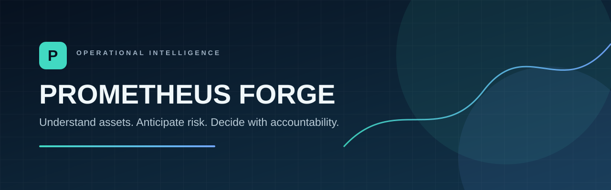
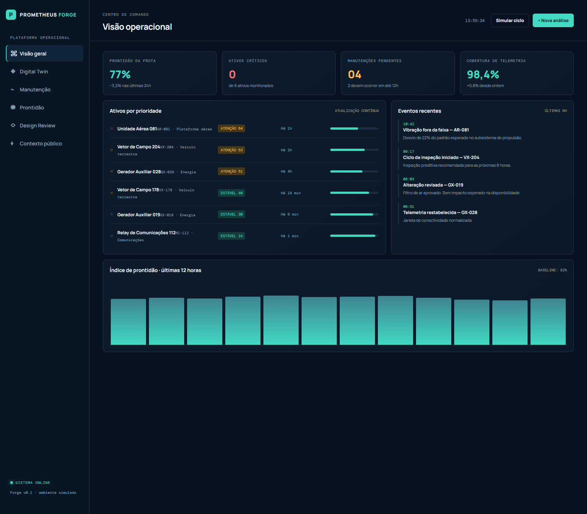
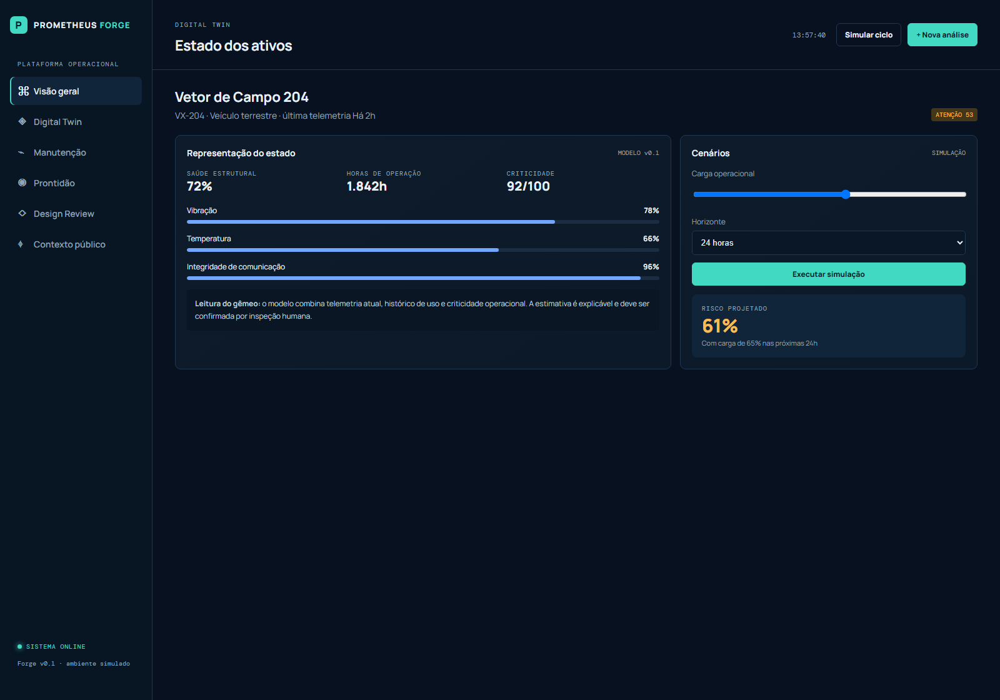
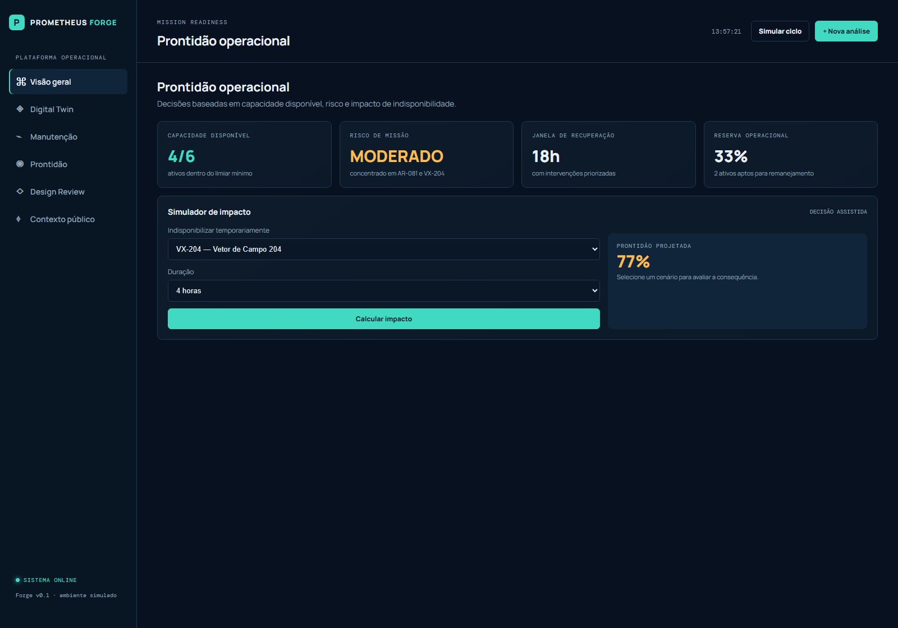

<p align="center">
  
</p>

<p align="center">
  <strong>Operational intelligence for physical assets.</strong><br />
  Understand condition · anticipate risk · decide with accountability.
</p>

<p align="center">
  <a href="#quick-start"></a>
  <a href="#production-deployment-baseline"></a>
  <a href="#security-and-governance-principles"></a>
  <a href="#product-capabilities"></a>
</p>

<p align="center">
  <a href="#quick-start">Quick start</a> ·
  <a href="#product-walkthrough">Screenshots</a> ·
  <a href="#architecture">Architecture</a> ·
  <a href="#roadmap">Roadmap</a> ·
  <a href="#security-and-governance-principles">Security</a>
</p>

---

> **Prometheus Forge** is an operational intelligence platform for understanding physical assets, anticipating risk, and supporting accountable engineering decisions.

Prometheus Forge is a local-first prototype for **physical operations intelligence**. It brings together asset condition, maintenance risk, operational readiness, engineering-change review, and public situational context in one decision console.

The product is inspired by the emerging idea of AI for the physical economy: reducing the time between observing a real-world system, understanding its state, evaluating alternatives, and taking an informed action. Forge is not an autonomous control system. It is deliberately designed to keep qualified people in control of consequential decisions.

> **Prototype notice:** all assets, telemetry, locations, and operational scenarios in this repository are synthetic. They do not represent real equipment, facilities, missions, or operational capabilities.

## Product walkthrough

<p align="center">
  
</p>

<p align="center"><sub><strong>Command Center</strong> — one operational view of readiness, critical assets, maintenance exposure, telemetry coverage, and recent events.</sub></p>

The interface is organized around six focused workspaces: **Command Center**, **Digital Twin**, **Maintainer**, **Mission Readiness**, **Design Review**, and **Public Context**. Together, they take an operator from a fleet-level signal to a traceable engineering decision without turning a recommendation into an automatic action.

<table>
  <tr>
    <td width="50%" valign="top"><strong>Digital Twin</strong><br /><sub>Inspect health, operating hours, technical signals, and a transparent risk projection.</sub><br /><br /></td>
    <td width="50%" valign="top"><strong>Mission Readiness</strong><br /><sub>Model the impact of an asset becoming unavailable before committing an operational decision.</sub><br /><br /></td>
  </tr>
</table>

| View | What it demonstrates |
| --- | --- |
| **Command Center** | Fleet readiness, maintenance backlog, telemetry coverage, asset priority, and recent events. |
| **Digital Twin** | Explainable asset condition, technical signals, and risk projection under a simulated load. |
| **Maintainer** | Maintenance prioritization that combines degradation, criticality, and operational urgency. |
| **Mission Readiness** | Operational-capacity impact of an asset becoming temporarily unavailable. |
| **Design Review** | Traceable technical-change screening with human approval kept in the loop. |
| **Public Context** | Official NOAA/NWS and USGS signals used strictly as situational context. |

## Why Forge

Teams responsible for critical assets often work across disconnected maintenance records, monitoring dashboards, engineering documents, and external risk feeds. That fragmentation makes it difficult to answer basic but high-value questions:

- Which assets need attention first, and why?
- What happens to operational capacity if an asset is unavailable?
- Does a proposed engineering change create an unacceptable operational risk?
- Does a public environmental signal warrant a human review of assets in a region?

Prometheus Forge provides a single, auditable workspace for exploring those questions.

## Product capabilities

| Capability | Purpose | Human outcome |
| --- | --- | --- |
| **Digital Twin** | Presents an explainable view of asset condition using health, runtime, vibration, temperature, and criticality. | Understand current condition and projected exposure. |
| **Maintainer** | Ranks maintenance actions by degradation, asset criticality, and operational urgency. | Focus limited maintenance capacity where it matters most. |
| **Mission Readiness** | Models the consequence of temporary asset unavailability. | Make clearer allocation, contingency, and recovery decisions. |
| **Design Review** | Screens component, configuration, and operating-load changes before they enter service. | Create a traceable recommendation for technical approval. |
| **Public Context** | Retrieves official weather alerts and recent seismic activity. | Add external situational awareness without automating an action. |
| **Audit Trail** | Records simulations, reviews, interventions, and external-context queries. | Preserve evidence for review, learning, and accountability. |

## Operating model

```text
Asset inventory ────────┐
Telemetry signals ──────┼──► Operational intelligence ───► Human decision console
Engineering changes ────┤              │
Public context feeds ───┘              └──► Persistent audit record
```

Forge can be adapted to fleets, energy assets, communications infrastructure, manufacturing equipment, logistics systems, and other asset-intensive environments. A production implementation must be tailored to its operational, safety, privacy, and regulatory context.

## Architecture

```text
┌──────────────────────────────────────────────────────────────┐
│                     Browser decision console                  │
│                index.html · app.js · styles.css               │
└─────────────────────────────┬────────────────────────────────┘
                              │ Local REST API
┌─────────────────────────────▼────────────────────────────────┐
│                      Node.js application                      │
│  input validation · static delivery · audit persistence       │
│  controlled proxy for approved public data providers          │
└───────────────┬──────────────────┬─────────────────┬─────────┘
                │                  │                 │
         Asset inventory       Audit history    Public context
         data/assets.json   data/audit.json      NOAA/NWS · USGS
```

The application server is the security boundary for public data sources. The browser calls Forge endpoints rather than arbitrary third-party URLs; the server restricts accepted providers and parameters before making an outbound request.

For endpoint details and architectural principles, see [docs/architecture.md](docs/architecture.md).

## Quick start

### Requirements

- [Node.js](https://nodejs.org/) 20 or later.

### Start the application

```powershell
npm start
```

Then open [http://localhost:3000](http://localhost:3000).

### Validate source syntax

```powershell
npm run check
```

## Local API

| Method | Endpoint | Description |
| --- | --- | --- |
| `GET` | `/api/health` | Service health, version, and server time. |
| `GET` | `/api/assets` | Demonstration asset inventory. |
| `GET` | `/api/audit` | Persisted audit history. |
| `POST` | `/api/audit` | Validated audit event creation. |
| `GET` | `/api/context/weather?area=CA` | Active alerts for a US state. |
| `GET` | `/api/context/earthquakes` | USGS M4.5+ earthquake feed for the past day. |

Health-check example:

```powershell
Invoke-RestMethod http://localhost:3000/api/health
```

## Production deployment baseline

The repository includes a PostgreSQL schema, migration runner, administrator provisioning script, Docker image, and Compose topology. Docker is not required for local demonstration mode, but it is the intended starting point for a deployable environment.

1. Copy `.env.example` to `.env` and replace every placeholder with production-grade values.
2. Set a distinct `POSTGRES_PASSWORD` in `.env` for Compose and ensure `DATABASE_URL` points to the same database.
3. Build and start the services:

```powershell
docker compose up -d --build
```

4. Run the database migrations and provision the initial administrator from a controlled shell:

```powershell
docker compose exec app npm run db:migrate
docker compose exec app npm run db:provision-admin
```

5. Verify the service through `/api/health` and place the application behind TLS at the ingress layer.

`DATABASE_URL` switches the runtime from local JSON demonstration storage to PostgreSQL. The health endpoint reports `persistence: postgresql` when the database connection is active.

Audit-event example:

```powershell
Invoke-RestMethod -Method Post `
  -Uri http://localhost:3000/api/audit `
  -ContentType 'application/json' `
  -Body '{"action":"Engineering review","detail":"Demonstration decision record"}'
```

## Data sources

Forge currently integrates only official, public US data sources and does not require API keys:

- [National Weather Service / NOAA — API documentation](https://www.weather.gov/documentation/services-web-api)
- [USGS — GeoJSON earthquake feeds](https://earthquake.usgs.gov/earthquakes/feed/v1.0/geojson.php)

External signals are contextual inputs only. They must not automatically change readiness, release an asset, change a control system, or issue a maintenance work order. In the current prototype, asset-to-state mapping is intentionally fictional and coarse-grained.

## Security and governance principles

Forge starts from conservative operational principles:

- **Human-in-the-loop:** recommendations are not authorizations.
- **Explainability:** risk prioritization is based on visible inputs such as health, vibration, temperature, and criticality.
- **Input validation:** audit payloads are type- and length-constrained at the API boundary.
- **Least exposure:** internal files under `data/` are not directly served as web assets.
- **Traceability:** relevant actions are recorded on the server; browser storage is only a demonstration convenience.
- **No sensitive operational data:** this repository ships exclusively with synthetic records.

Before any real-world deployment, add identity management, role-based access control, encrypted storage and transport, secret management, audit immutability, retention policies, threat modeling, operational approval workflows, and compliance review.

## Repository layout

```text
.
├── app.js                 # Decision console behavior and UI logic
├── index.html             # Web application shell
├── styles.css             # Visual system and responsive layout
├── server.js              # Local API, validation, persistence, context proxy
├── data/
│   ├── assets.json        # Synthetic asset inventory
│   └── audit.json         # Persisted audit history
├── docs/
│   └── architecture.md    # Architecture and API contract
├── package.json           # Development scripts
└── .gitignore
```

## Roadmap

### Foundation

- [x] Operational console with Digital Twin, Maintainer, Readiness, and Design Review modules.
- [x] Local REST API and persisted demonstration data.
- [x] Auditing for relevant user interactions.
- [x] Controlled NOAA/NWS and USGS public-context integrations.
- [ ] Automated API and interface test suite.

### Operational intelligence

- [ ] Authenticated telemetry ingestion and an event-processing pipeline.
- [ ] Time-series storage, asset history, and data-quality controls.
- [ ] Configurable risk policies and explainable anomaly detection.
- [ ] Scenario library, recovery planning, and multi-step approvals.
- [ ] Geospatial asset scope with explicit authorization controls.

### Production readiness

- [ ] PostgreSQL persistence and versioned migrations.
- [ ] OIDC authentication and role-based access for operator, engineer, approver, and auditor personas.
- [ ] Immutable audit evidence, retention policies, and export controls.
- [ ] Application observability, rate limiting, health checks, and alerting.
- [ ] Container deployment, CI/CD, security scanning, and environment configuration.

## Development direction

The next important step is to replace the demonstration JSON store with a proper data model and database, while preserving the existing audit contract. From there, the project can add authenticated ingestion, role-aware workflows, validated data science models, and deployment automation without turning automated recommendations into autonomous decisions.

## License and usage

This repository is an evolving prototype. Select an appropriate license and establish data-governance, safety, and accountability requirements before using it in a professional or operational environment.
