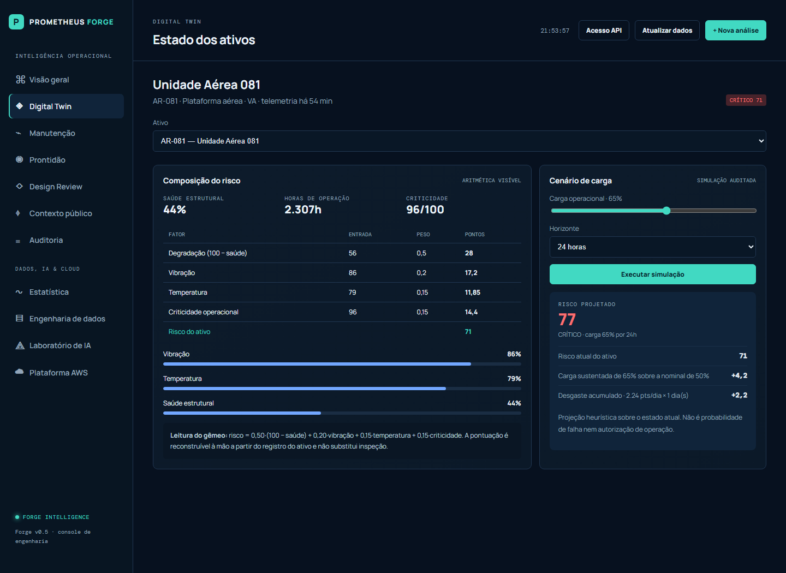
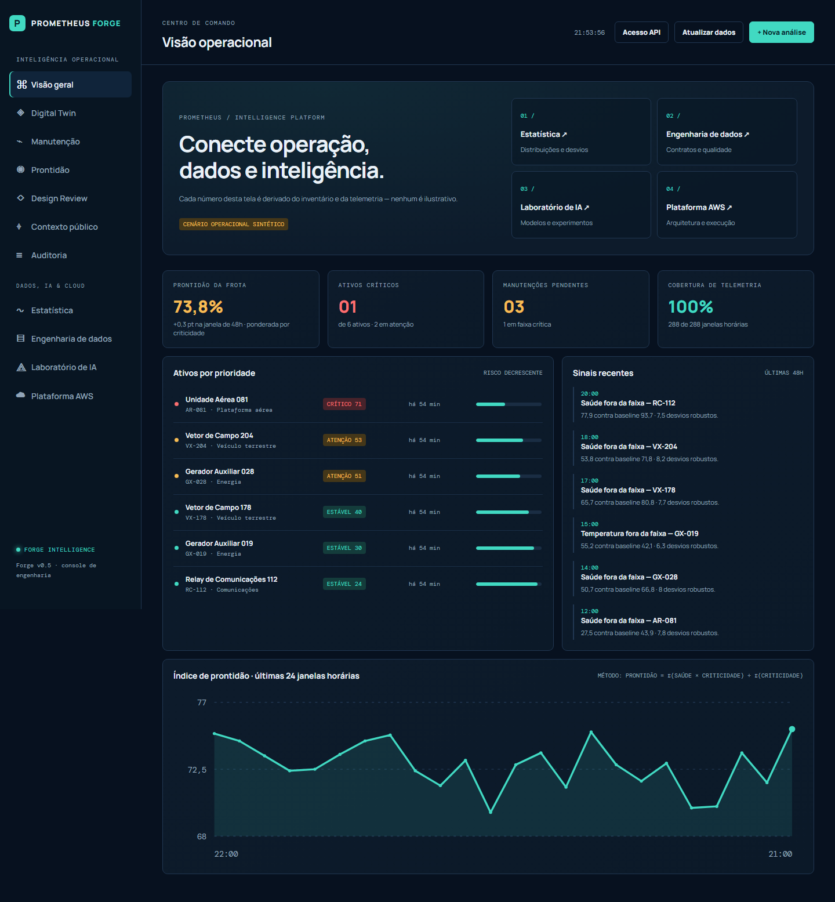
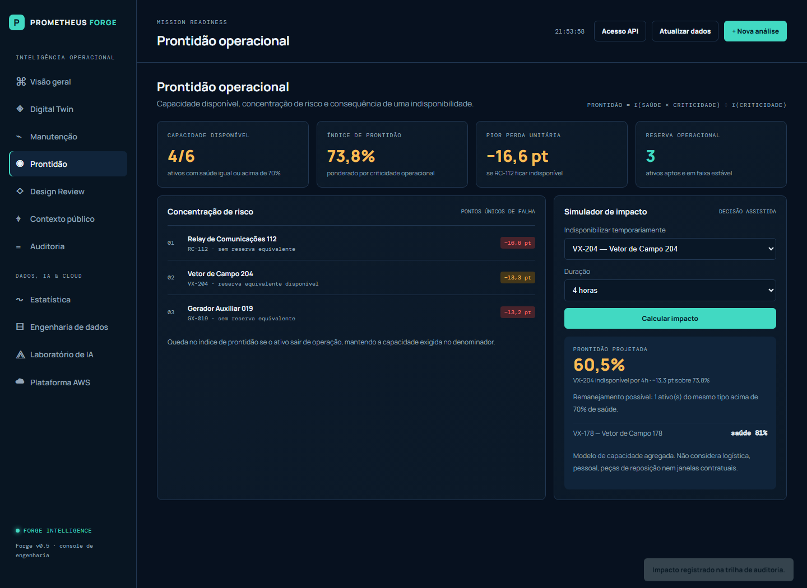
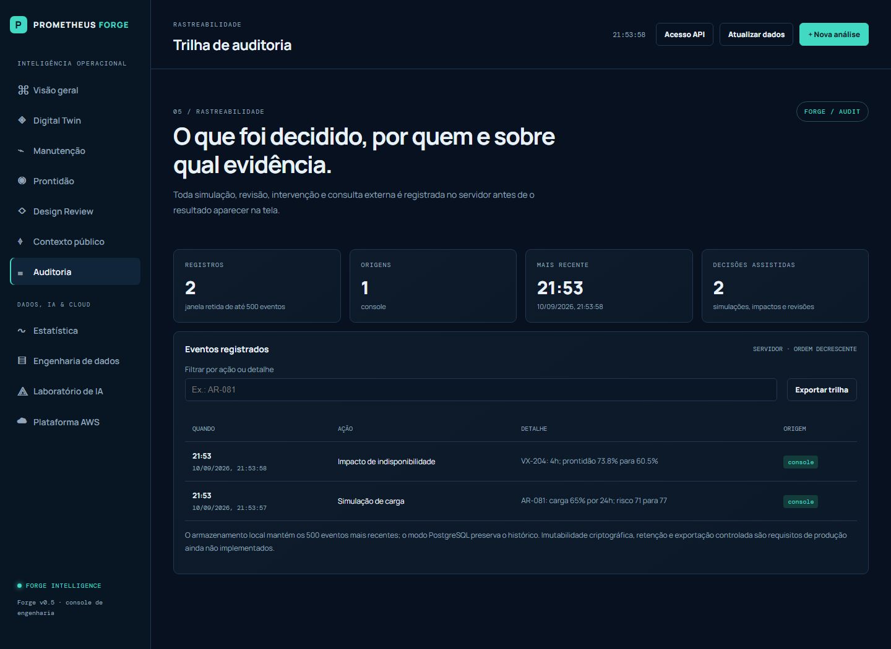
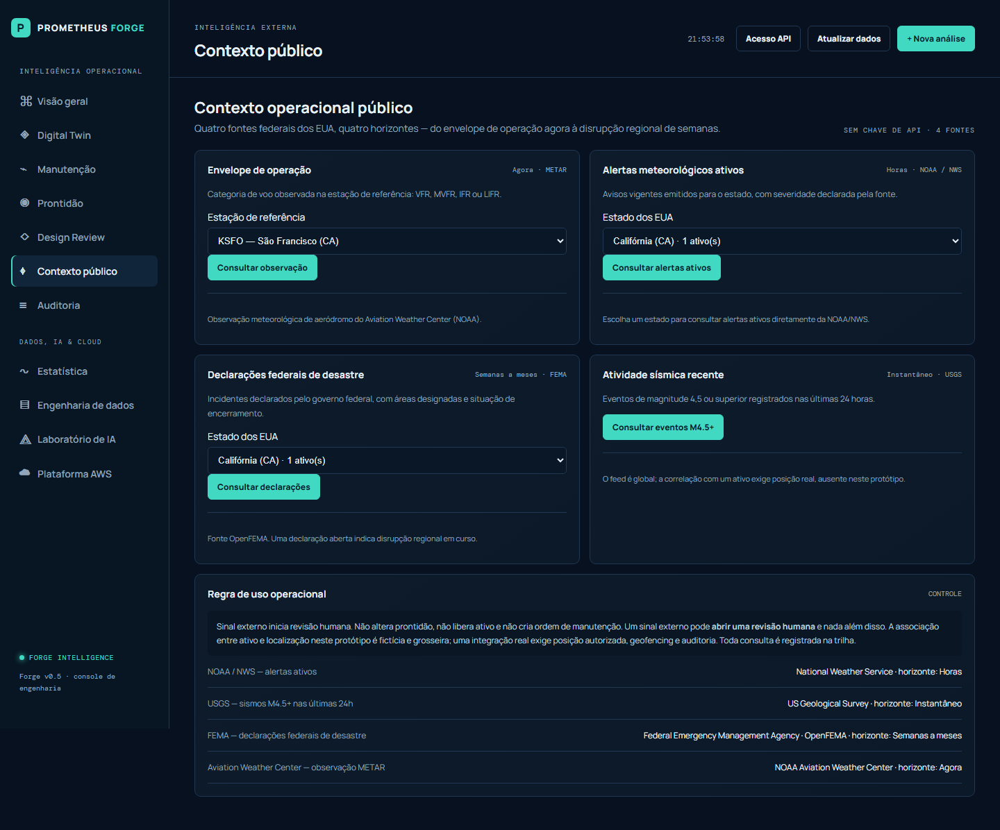
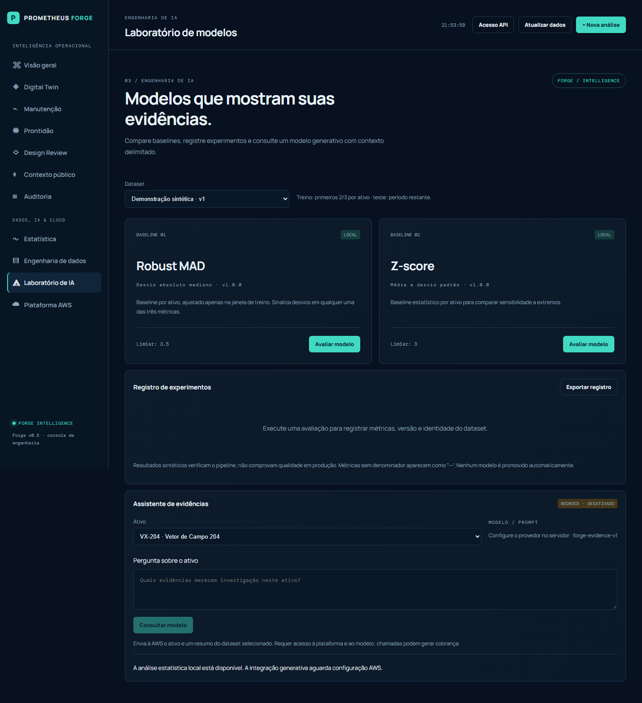

<p align="center">
  
</p>

<p align="center">
  <strong>Operational intelligence for physical assets.</strong><br />
  Understand condition · anticipate risk · decide with accountability.
</p>

<p align="center">
  <a href="#quick-start"></a>
  <a href="#tests"></a>
  <a href="#dependencies"></a>
  <a href="#public-federal-context"></a>
  <a href="#production-baseline"></a>
  <a href="LICENSE"></a>
</p>

<p align="center">
  <a href="#the-idea">The idea</a> ·
  <a href="#the-console">Screenshots</a> ·
  <a href="#the-decision-model">Decision model</a> ·
  <a href="#quick-start">Quick start</a> ·
  <a href="#architecture">Architecture</a> ·
  <a href="#what-is-deliberately-not-built">Limits</a>
</p>

---

Prometheus Forge is a decision console for physical operations: it brings asset condition, maintenance risk, mission readiness, engineering-change review and official public context into one place, so a qualified person can see a fleet, understand why it looks that way, and act with a record of what they decided.

It is **not** an autonomous control system. Recommendations are never authorizations.

> **Prototype notice** — every asset, telemetry sample and operational scenario in this repository is synthetic. They do not represent real equipment, facilities, missions or capabilities. The public data feeds are real and official.

## The idea

Most operational dashboards ask you to trust a number. This one asks you to check it.

**No figure reaches the screen without its arithmetic.** Every value in the console is derived from the inventory, the telemetry or the audit trail by a pure, tested function — there is not one illustrative constant, decorative KPI or hardcoded sample series in the interface. When the console says an asset scores 71, it shows the four terms that add up to 71.

<p align="center">
  
</p>

<p align="center"><sub><strong>Digital Twin</strong> — 28 + 17,2 + 11,85 + 14,4 = 71,45. The projection beside it shows its own three terms and states its limits.</sub></p>

This constraint drives the whole design: the decision model lives in one tested module, the server applies it, the browser only draws what it received, and the method travels with the result.

## The console

<p align="center">
  
</p>

<p align="center"><sub><strong>Command Center</strong> — readiness weighted by criticality, coverage as observed windows over expected, and deviations found with a robust baseline. Every one of them computed, none of them typed in.</sub></p>

<table>
  <tr>
    <td width="50%" valign="top"><strong>Mission Readiness</strong><br /><sub>What the fleet loses if an asset goes out of service, and whether a like-for-like reserve exists.</sub><br /><br /></td>
    <td width="50%" valign="top"><strong>Audit Trail</strong><br /><sub>Every simulation, impact and review recorded server-side before its result was drawn.</sub><br /><br /></td>
  </tr>
  <tr>
    <td width="50%" valign="top"><strong>Public Context</strong><br /><sub>Four official US federal sources across four time horizons.</sub><br /><br /></td>
    <td width="50%" valign="top"><strong>Model Lab</strong><br /><sub>Chronological evaluation, confusion matrices and a reproducible experiment record.</sub><br /><br /></td>
  </tr>
</table>

Eleven workspaces, grouped in two families:

| Operational | What it answers |
| --- | --- |
| **Command Center** | What is the state of the fleet, and what changed? |
| **Digital Twin** | Why does this asset score what it scores? |
| **Maintainer** | What should be inspected first, and on what grounds? |
| **Mission Readiness** | What happens to capacity if this asset is unavailable? |
| **Design Review** | Can this engineering change enter service, or does it need formal approval? |
| **Public Context** | Is there an external signal that warrants a human review? |
| **Audit Trail** | What was decided, when, and on which evidence? |

| Data, AI and cloud | What it answers |
| --- | --- |
| **Statistics** | How is this signal distributed, where does it trend, where does it deviate? |
| **Data Engineering** | Is the data valid, complete, labelled and traceable to its origin? |
| **Model Lab** | How do baselines compare on a chronological split, and is the run reproducible? |
| **AWS Platform** | What is this instance actually running, and what is the target architecture? |

## The decision model

`lib/operations.js` is the single source of truth about asset condition. Server, browser and tests share one definition, and the weights are explicit so a reviewer can redo any calculation by hand.

| Quantity | Definition |
| --- | --- |
| **Asset risk** | `0.50·(100 − health) + 0.20·vibration + 0.15·temperature + 0.15·criticality` → bands at 70 and 45 |
| **Fleet readiness** | `Σ(health × criticality) ÷ Σ(criticality)` — capability actually delivered, not nominal |
| **Coverage** | observed hourly windows ÷ expected windows over the dataset span |
| **Freshness** | age of the most recent sample; beyond three hours an asset is marked stale |
| **Exposure** | readiness lost if an asset goes out of service, ranked across the fleet |

One consequence of the readiness index is deliberate and pinned by a test: **losing an already-degraded asset costs less than losing a healthy one**, even at higher criticality, because half a capability was only ever delivering half.

Assets carry no stored `status` field. Migration `004` dropped that column precisely because a hand-written label can disagree with the computed score, and two versions of one truth can only produce contradiction.

### Decisions are recorded before they are returned

Three endpoints produce recommendations. Each writes to the audit trail **before** responding, and each returns the terms behind the number plus the limits of the method.

```powershell
Invoke-RestMethod -Method Post -Uri http://localhost:3000/api/decisions/scenario `
  -ContentType 'application/json' -Body '{"assetId":"AR-081","load":90,"horizonHours":72}'
```

```json
{
  "baseRisk": 71, "projectedRisk": 89, "band": "critical",
  "terms": [
    { "label": "Risco atual do ativo", "points": 71 },
    { "label": "Carga sustentada de 90% sobre a nominal de 50%", "points": 11.2 },
    { "label": "Desgaste acumulado · 2.24 pts/dia × 3 dia(s)", "points": 6.72 }
  ],
  "limitation": "Projeção heurística sobre o estado atual. Não é probabilidade de falha nem autorização de operação."
}
```

Design Review returns `acceptable`, `controlled` or `blocked` — a routing decision about which level of human review a change needs. It approves nothing.

## Public federal context

Four official US sources, no API keys, chosen because they cover four different horizons of the same question:

| Source | Horizon | What it tells you |
| --- | --- | --- |
| [Aviation Weather Center](https://aviationweather.gov/) (METAR) | Now | Operating envelope at the reference airfield: VFR, MVFR, IFR, LIFR |
| [NOAA / NWS](https://www.weather.gov/documentation/services-web-api) | Hours | Active weather alerts per state, with the issuer's own severity |
| [USGS](https://earthquake.usgs.gov/earthquakes/feed/v1.0/geojson.php) | Instant | M4.5+ seismic events in the last 24 hours |
| [FEMA / OpenFEMA](https://www.fema.gov/about/openfema/api) | Weeks to months | Federal disaster declarations, designated areas and closure status |

The server is the boundary. `lib/context.js` declares each source's host, accepted parameters and normalisation; the browser never picks a URL. An invalid parameter is refused **before** any outbound request, and every payload is reduced to one shape — `{ id, title, detail, area, at, severity }` — with fields truncated and whitespace collapsed, so no third-party text reaches the console verbatim.

An external signal opens a human review. It does not change readiness, release an asset, or create a work order.

## Quick start

Requires [Node.js](https://nodejs.org/) 20 or later.

```powershell
npm ci
npm start
```

Open [http://localhost:3000](http://localhost:3000). The demonstration telemetry is a rolling 48-hour window ending at the current hour, so freshness and coverage on the console are real rather than decorative.

Jump straight to a workspace with `?view=`: [overview](http://localhost:3000/?view=overview), [twin](http://localhost:3000/?view=twin), [readiness](http://localhost:3000/?view=readiness), [audit](http://localhost:3000/?view=audit), [context](http://localhost:3000/?view=context), [statistics](http://localhost:3000/?view=statistics), [models](http://localhost:3000/?view=models), [platform](http://localhost:3000/?view=platform).

`npm start` does not read `.env` automatically. Use `node --env-file=.env server.js` (Node 20.6+) or Docker Compose.

### Collect public context on a schedule

```powershell
npm run collect:context
```

Fetches every federal source for the states present in the inventory and stores normalised snapshots. One failing source never fails the run. This is the seam designed to become a separate service — see [docs/services.md](docs/services.md).

## Tests

```powershell
npm run check   # syntax across every JS file and CloudFormation document
npm test        # 36 unit and API tests
npm run test:ui # 8 browser tests, Chromium
```

The suites assert the properties the product claims, not just that pages load:

- risk scores are **reconstructible by hand**, and the terms shown in the browser must add up to the badge beside them;
- an empty dataset reports **no** coverage rather than zero;
- a decision that is refused leaves **no** audit record, and one that succeeds leaves exactly one;
- the public-context proxy refuses an invalid parameter **before** any outbound request, and every provider reaches only the host it declares;
- hostile upstream content is bounded — long fields truncated, whitespace collapsed;
- test-window data cannot influence a fitted training baseline;
- every workspace fits a 390 px viewport with no horizontal scroll.

Browser tests never touch a federal API: the proxy runs disabled, so the console's refusal path is what gets exercised. The screenshots in this README are produced by the capture test in `tests/workspaces.spec.js`.

## Architecture

```text
Console (browser)  core.js · app.js · workspaces.js — no build step
        │ REST, same origin, strict CSP
server.js          token auth · validation · rate limiting · security headers · structured logs
        │
lib/   operations  risk, readiness, exposure, decisions
       intelligence statistics, baselines, chronological evaluation
       context     four federal sources, declared and normalised
       bedrock     optional Amazon Bedrock Converse adapter
        │
database.js        local runtime files  ·  or PostgreSQL with versioned migrations
```

Full detail, including the security boundary and the complete API table, in [docs/architecture.md](docs/architecture.md). The data, statistics and AI layer is described in [docs/intelligence-platform.md](docs/intelligence-platform.md).

### Dependencies

The HTTP server uses **only Node built-ins**. The console has **no dependencies and no build step** — three plain scripts and one stylesheet. The two runtime packages are `pg`, used only when `DATABASE_URL` is set, and the AWS Bedrock SDK, loaded lazily and only when generative explanation is enabled.

The console builds HTML through a tagged template that escapes every interpolation by default; injecting markup requires an explicit `Forge.raw`.

## Production baseline

```powershell
docker compose up -d --build
docker compose exec app npm run db:migrate
docker compose exec app npm run db:provision-admin
```

`DATABASE_URL` switches persistence from local runtime files to PostgreSQL; `/api/health` then reports `persistence: postgresql`. `data/` is a read-only seed and every write goes to the runtime directory, so the container can run on a read-only root filesystem.

Copy `.env.example` to `.env` and replace every placeholder before deploying. Place the application behind TLS at the ingress. CloudFormation templates for ECR, S3, ECS Fargate, private HTTPS ingress, IAM, secrets and logs are in [infra/aws/](infra/aws/README.md) — they are versioned and linted in CI, and have not been applied to an account.

## Security and governance

- **Human in the loop** — recommendations are not authorizations, and nothing in the system executes an action on an asset.
- **Explainability** — every score ships with the terms that produced it and a statement of what the method does not cover.
- **Traceability** — consequential actions are recorded on the server before their result is returned. Browser storage is not used as a record.
- **Least exposure** — static delivery is confined to `public/` by path containment, not by a list of filenames; `data/`, `lib/` and configuration are unreachable over HTTP.
- **Input validation** — telemetry batches, decision parameters, audit payloads and public-context parameters are all type- and range-checked at the boundary.
- **Controlled egress** — the server decides which external hosts exist; the browser cannot reach an arbitrary URL through it.
- **No sensitive operational data** — this repository ships only synthetic records.

## What is deliberately not built

Stated plainly, because a prototype that hides its gaps is worse than one that names them:

- **No identity.** A single shared API token is not authentication. There is no user, no role, no per-person attribution in the audit trail.
- **No audit immutability.** Records can be rewritten by anyone with database access. No hash chain, no retention policy, no export controls.
- **No validated models.** The baselines are exercised against synthetic labels. That verifies the pipeline; it demonstrates nothing about production performance. Nothing is promoted automatically.
- **No real asset positions.** The asset-to-state mapping is fictional and coarse. Correlating a public signal with a real asset needs authorised positioning, geofencing and its own audit.
- **Single-instance rate limiting.** The limiter is in-memory; several instances need a shared counter.
- **Untested cloud deployment.** The AWS templates are linted, not applied.

## Roadmap

**Done**

- [x] Decision console with eleven workspaces, fully API-driven.
- [x] Shared, tested decision model — risk, readiness, exposure, projections, change screening.
- [x] Server-recorded audit trail with a workspace to inspect and export it.
- [x] Four official federal context sources, declared server-side and normalised.
- [x] Validated telemetry ingestion, statistics, baselines and a reproducible experiment record.
- [x] PostgreSQL persistence with versioned migrations, Docker, CloudFormation and CI.
- [x] Automated API, unit and browser test suites.
- [x] Security headers, CSP, rate limiting and structured request logging.

**Next**

- [ ] OIDC identity and role-based access for operator, engineer, approver and auditor.
- [ ] Audit immutability, retention policy and controlled export.
- [ ] Scheduled context collection running in AWS, with history in PostgreSQL and S3.
- [ ] Representative labelled data and honest model validation.
- [ ] Multi-step approval workflows and a scenario library.
- [ ] Geospatial asset scope with explicit authorization controls.

## License

[MIT](LICENSE). Before using this in a professional or operational setting, establish the applicable data-governance, safety, regulatory and accountability requirements.
