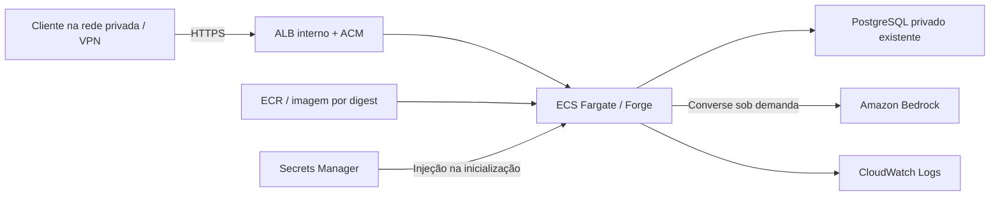

# AWS para Prometheus Forge

Dois templates CloudFormation preparam uma implantação privada. Eles não foram aplicados à conta. A execução local não depende de AWS.



`foundation.json` cria ECR com tags imutáveis, bucket S3 privado/versionado com exigência de TLS, cluster ECS, logs com retenção de 30 dias e task role. Inferência só é permitida com ARNs Bedrock explicitamente fornecidos. S3 é uma fundação para artefatos futuros: upload ainda não está implementado. Bucket, repositório e logs são retidos quando a stack é removida.

`runtime.json` define tarefa Fargate de 0,5 vCPU / 1 GiB, imagem por digest, filesystem somente leitura, serviço sem IP público, ALB interno HTTPS, verificações de saúde e rollback de implantação. `DesiredCount` começa em **0**, permitindo migrar antes de receber tráfego. O ALB gera custos mesmo sem tarefas.

## Pré-requisitos

1. Conta, região e permissões CloudFormation/IAM escolhidas. O modelo precisa suportar Converse na região. Para inference profiles, permita o ARN do perfil e os ARNs dos modelos/regiões subjacentes.
2. VPC existente e ao menos duas subnets privadas em AZs distintas, com DNS e roteamento. As tarefas precisam alcançar ECR (incluindo S3 para camadas), Logs, Secrets Manager e Bedrock via NAT ou endpoints apropriados.
3. PostgreSQL privado na porta 5432, por exemplo RDS, com TLS e backups configurados. O template não cria o banco. Autorize o security group da aplicação no banco após obter `AppSecurityGroupId`. Separe as identidades de aplicação e migração.
4. Dois segredos Secrets Manager, como strings completas: URL do banco em `DatabaseSecretArn` e token aleatório de pelo menos 32 caracteres em `ApiTokenSecretArn`. Parâmetros recebem ARNs, nunca valores secretos. `SecretKmsKeyArn` permite uma chave própria comum aos dois segredos; ajuste a política para chaves distintas.
5. Certificado ACM na mesma região, hostname DNS privado correspondente e cliente com VPN/rede privada. `ClientCidr` limita a entrada HTTPS. Crie o alias DNS; o hostname bruto do ALB não corresponde ao certificado.
6. Para RDS, inclua no build a CA PEM do [trust store oficial](https://docs.aws.amazon.com/AmazonRDS/latest/UserGuide/UsingWithRDS.SSL.html), por exemplo `certs/global-bundle.pem`. Defina `DatabaseCaPath=/app/certs/global-bundle.pem`, verifique procedência e planeje atualização. Não desative a validação TLS. Evite parâmetros `sslmode` na URL que possam sobrescrever a configuração SSL do driver.

## Validar e revisar

```powershell
py -m pip install -r infra/aws/requirements.txt
py -m cfnlint infra/aws/foundation.json infra/aws/runtime.json
aws cloudformation validate-template --template-body file://infra/aws/foundation.json
aws cloudformation validate-template --template-body file://infra/aws/runtime.json
```

Exemplo de change set para revisão da fundação:

```powershell
aws cloudformation create-change-set --stack-name forge-foundation --change-set-name foundation-review --change-set-type CREATE --template-body file://infra/aws/foundation.json --capabilities CAPABILITY_IAM
aws cloudformation describe-change-set --stack-name forge-foundation --change-set-name foundation-review
```

Executar o change set é a etapa separada de implantação. Revise IAM, recursos e custos antes dela. Depois, use os outputs da fundação para preparar a execução. Construa a imagem com Docker, publique no ECR usando tag única e informe `ImageUri` por digest (`repository@sha256:...`).

Crie localmente `runtime.parameters.json`, ignorado pelo Git, no formato de parâmetros CloudFormation. Ele deve conter referências a segredos, nunca seus valores. Parâmetros obrigatórios: `VpcId`, `PrivateSubnets`, `ClientCidr`, `CertificateArn`, `ClusterArn`, `TaskRoleArn`, `RepositoryArn`, `ImageUri`, `LogGroupName`, `DatabaseSecretArn`, `ApiTokenSecretArn`.

```powershell
aws cloudformation create-change-set --stack-name forge-runtime --change-set-name runtime-review --change-set-type CREATE --template-body file://infra/aws/runtime.json --parameters file://infra/aws/runtime.parameters.json --capabilities CAPABILITY_IAM
aws cloudformation describe-change-set --stack-name forge-runtime --change-set-name runtime-review
```

Após revisão e execução, mantenha `DesiredCount=0`. Autorize a conexão ao banco e execute `node scripts/migrate.js` em uma tarefa avulsa com a mesma imagem/rede, usando identidade de migração. A definição do serviço injeta o segredo do usuário da aplicação: para migrar, prepare uma definição temporária com segredo de migração e health check adequado a uma tarefa curta. Não conceda DDL permanentemente à aplicação. Aguarde as três migrações antes de atualizar a stack com `DesiredCount=1`. Valide DNS privado, `/api/health`, acesso por token e persistência. O seed de inventário continua sintético.

## Limites de operação

- Modelo e IAM precisam concordar nas duas stacks. `BedrockModelId` vazio desativa IA generativa. Credenciais são fornecidas pelo task role.
- O painel mostra configuração do processo, sem consultar a conta AWS. “Configurado” não comprova inferência ou autorização.
- O limite de chamadas de IA é por processo. Com múltiplas tarefas, acrescente controle central de consumo. Auto scaling, alarmes, painéis CloudWatch, SSO e RBAC ainda não estão implementados.
- Segredos injetados em variáveis só mudam quando a tarefa reinicia. Faça nova implantação controlada após rotação.
- Retenção precisa seguir a política da organização. Não há jobs S3, Glue, SageMaker ou Kinesis nesta versão.
- Preços não foram estimados. ALB, armazenamento, logs, tráfego/NAT, banco, tarefas e inferência podem gerar cobrança. A remoção das stacks preserva recursos marcados como retidos.

Referências: [ECS TaskDefinition](https://docs.aws.amazon.com/AWSCloudFormation/latest/TemplateReference/aws-resource-ecs-taskdefinition.html), [Secrets Manager no ECS](https://docs.aws.amazon.com/AmazonECS/latest/developerguide/secrets-envvar-secrets-manager.html), [Bedrock Runtime SDK](https://docs.aws.amazon.com/AWSJavaScriptSDK/v3/latest/client/bedrock-runtime/).
